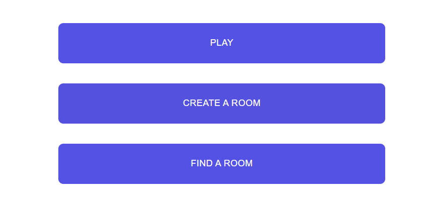
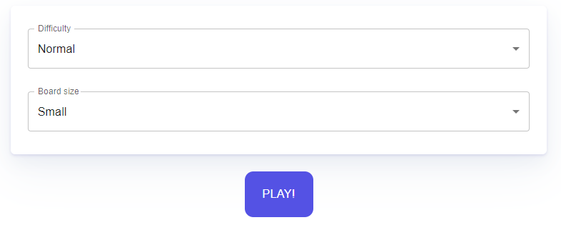
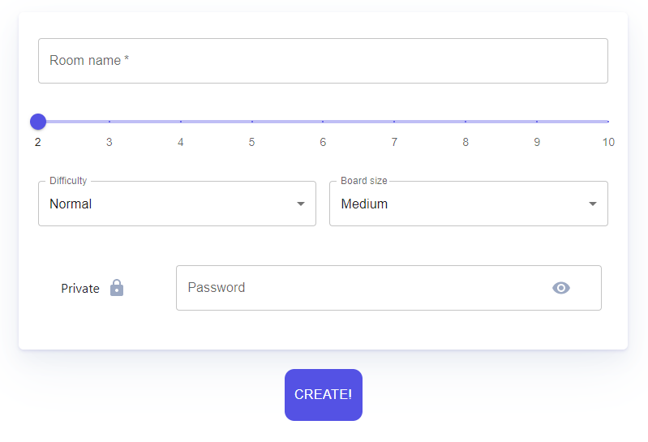

# HashiPlayero

Hashiplayero is a web application that allows users to play a game of [Hashiwokakero](https://pl.wikipedia.org/wiki/Hashiwokakero). 

This application was made by students from Wrocław University of Science and Technology under supervision from Nokia Wrocław employees as a university task.

It is currently deployed and can be acsessible via https://hashiplayero.herokuapp.com.

**Project goals**
With this application user gets the abiliy to play a hasiwokakero game either in singleplayer or multiplayer mode. In multiplayer mode user can create a room with given settings or join one. If game is already started, player can't join another one.

**Techonolgies**
Implementation of this app was achived by using:
Frontend:
- [React with Typescript](https://github.com/facebook/react)
- [Redux](https://github.com/reduxjs/redux)
- [Konva](https://github.com/konvajs/react-konva)
- [MUI](https://github.com/mui/material-ui)
Backend:
- [Go](https://github.com/golang/go)
- [Gorilla WebSocket](https://github.com/gorilla/websocket)
- [Gin](https://github.com/gin-gonic/gin)

# Features overview
First, a user is welcomed with main menu and is given a choice to pick a singleplayer game via Play button, host multiplayer game via Create Game button or join multiplayer game via Find Room button.

**Singleplayer**
Having picked Play button, user has to pick puzzle dificulty and board size. After choice is made, player should click Play button in order to begin a game.

**Multiplayer**
Having picked Create Game, user has to pick different settings in order to start a lobby. After choice is made, player should click Create button to create a lobby. Being a admin, player can begin game, edit settings and exit lobby.

**Team**
Students divided into two group responsible for front- and backend of an app.
Frontend:
- [Rafał Rodak](https://github.com/rodakrafal) 
- [Paweł Różański](https://github.com/RozanskiP)
- [Bartosz Szymczak](https://github.com/PewPewBartula)
Backend:
- [Michał Sieroń](https://github.com/michalsieron)
- [Piotr Rodziewicz](https://github.com/rodziewiczpiotr)
- [Mateusz Marciniec](https://github.com/mateuszmar2)
