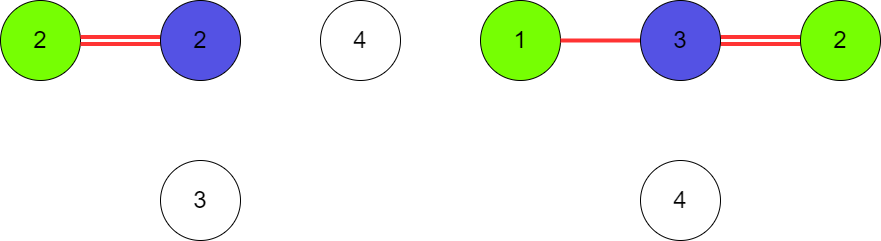

# HashiPlayero

HashiPlayero is a web application that allows users to play a game of [Hashiwokakero](https://pl.wikipedia.org/wiki/Hashiwokakero). 

This application was made by students from Wrocław University of Science and Technology under supervision from Nokia Wrocław employees as a university task.

It is currently deployed and can be accsessed via https://hashiplayero.pl.

**Project goals**

 With this application user gets the abiliy to play a hashiwokakero game either in singleplayer or multiplayer mode. In multiplayer mode user can create a room with given settings or join one. If game is already started, player can't join another one. In singleplayer mode player can generate a new board with given settings or replay previous game by giving correct board number.

**Techonolgies**

Implementation of this app was achived by using:

Frontend:

- [React with Typescript](https://github.com/facebook/react)
- [Redux](https://github.com/reduxjs/redux)
- [Konva](https://github.com/konvajs/react-konva)
- [MUI](https://github.com/mui/material-ui)

Backend:
- [Go](https://github.com/golang/go)
- [Gorilla WebSocket](https://github.com/gorilla/websocket)
- [Gin](https://github.com/gin-gonic/gin)
- [Sqlite](https://github.com/mattn/go-sqlite3)

# Features overview
First, a user is welcomed with main menu and is given a choice to pick a singleplayer game via Play button, host multiplayer game via Create Game button or join multiplayer game via Find Room button.

**Singleplayer**
- Having picked Play button, user has to pick puzzle dificulty and board size. After choice is made, player should click Play button in order to begin a game.

- In order to replay a game, user has to click replay button and insert correct board ID.

**Multiplayer**
- Having picked Create Game, user has to pick different settings in order to start a lobby. After choice is made, player should click Create button to create a lobby. Being a admin, player can begin game, edit settings and exit lobby.

# Algorithms overview
`hashi` module has two main parts: board generator and solver. Board generator uses solver to werify generated boards.

**Board generation**

This algorithm is described in the block diagram below.

**Board solving**

There are 3 different difficulty levels:
- easy - on this level solver will connect islands if number of possible connections is equal to number shown on the currently checked island. For example island with number 6 and three neighbours of which each can connect two bridges, will place those bridges. 

- normal - on this level solver will try to "flood" bridges. That is, if solver knows that at least 1 bridge must be connected to each neighbour, it will place them.
  Besides that, normal level solver uses mechanics from easy level solver.

- hard - this solver does not place bridges on its own. Instead it bans bridge locations where placing a bridge would casue invalid board state.
  Thanks to limiting possible bridge locations, hard setups are reduced to ones possible to solve by easy and normal level solvers.

Solver on each level uses solvers from lower levels. To solve a board, solver tries to make an action in a loop.
When no action was made and the board is not solved, it is cosidered either to hard or invalid in which case it is discarded and new board is being generated.

# Team

Students divided into two group responsible for frontend and backend of an app.

Frontend:

- [Rafał Rodak](https://github.com/rodakrafal) 
- [Paweł Różański](https://github.com/RozanskiP)
- [Bartosz Szymczak](https://github.com/PewPewBartula)

Backend:

- [Michał Sieroń](https://github.com/michalsieron)
- [Piotr Rodziewicz](https://github.com/rodziewiczpiotr)
- [Mateusz Marciniec](https://github.com/mateuszmar2)
